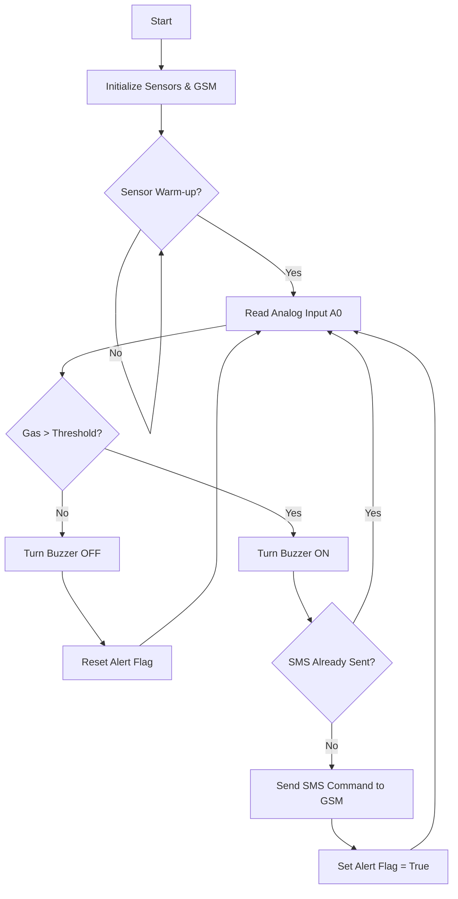
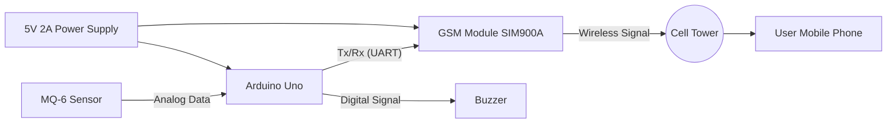

# 🛡️ IoT-Based CNG/LPG Gas Leakage Detector

An Arduino-based safety system designed to detect gas leakages (CNG/LPG) in real-time. Upon detection, the system triggers an audiovisual alarm and sends an immediate SMS alert to a specified mobile number via a GSM module, providing the location of the leak.

---

## 📖 Description

Gas leakage in residential or industrial environments poses a severe threat to life and property. This project aims to mitigate that risk by automating the detection and alert process. 

The system continuously monitors air quality using an **MQ-series gas sensor**. If the gas concentration exceeds a calibrated threshold:
1.  A local **buzzer** sounds an alarm to warn occupants immediately.
2.  A **GSM module** sends an SMS alert to the owner's phone with the specific location of the leak (e.g., "Kitchen - Main Valve").

---

## ⚙️ Components Required

### Hardware
* **Microcontroller:** Arduino Uno (or compatible board like Nano/Mega)
* **Gas Sensor:** MQ-6 (Specific for LPG/Propane) or MQ-2 (General Combustible Gas/Smoke)
* **Communication:** SIM900A or SIM800L GSM Module
* **SIM Card:** 2G-compatible SIM card with an active SMS plan
* **Alarm:** Active Piezo Buzzer (5V)
* **Power:** * USB Cable (for Arduino)
    * External 5V 2A Power Adapter (Crucial for the GSM module)
* **Connecting Wires:** Jumper wires (Male-to-Male, Male-to-Female)
* **Breadboard**

### Tech Stack
* **Language:** C++ (Arduino)
* **IDE:** Arduino IDE
* **Libraries:** `SoftwareSerial.h` (Standard Arduino library)

---

## 🏗️ System Architecture

### Data Flow Diagram

### Circuit Flow Diagram

### Part 4: Wiring and Connections

---

## 🔌 Circuit Connections

| Component | Pin Name | Arduino Pin | Note |
| :--- | :--- | :--- | :--- |
| **MQ Sensor** | A0 (Analog Out) | `A0` | |
| **MQ Sensor** | VCC | `5V` | |
| **MQ Sensor** | GND | `GND` | |
| **Buzzer** | Positive (+) | `D8` | |
| **Buzzer** | Negative (-) | `GND` | |
| **GSM Module** | RX | `D10` | Connects to Arduino Software TX |
| **GSM Module** | TX | `D9` | Connects to Arduino Software RX |
| **GSM Module** | GND | `GND` | **Must** share common ground with Arduino |

---

## 🛠️ Setup & Calibration

1.  **Hardware Assembly:** Connect components according to the circuit connections table above. Ensure the GSM module is powered by an external source if necessary.
2.  **Code Configuration:**
    * Open `GasLeakageSystem.ino`.
    * Update `MOBILE_NUMBER` with your country code (e.g., `+91...` or `+1...`).
    * Update `ROOM_NAME` to identifying the sensor's location.
3.  **Upload:** Flash the code to the Arduino Uno.
4.  **Warm-up:** Allow the sensor to run for at least **20 seconds** (pre-heat time) before testing.
5.  **Calibration:**
    * Open the Serial Monitor (Baud Rate: 9600).
    * Observe the "Current Gas Level" value in fresh air (usually 100-200).
    * Expose the sensor to a small amount of gas (e.g., from a lighter, *without* flame).
    * Note the value when gas is present (e.g., 600+).
    * Set `GAS_THRESHOLD` in the code to a value in between (e.g., `400`).

---

## 🚀 Usage Instructions

1.  Power on the system.
2.  Wait for the "System Armed and Ready" message in the Serial Monitor.
3.  The device will now monitor air quality continuously.
4.  **Test:** Release a small amount of gas near the sensor.
    * **Result:** The buzzer should beep loudly, and you should receive an SMS on the configured phone number.

---

## ❓ Troubleshooting

| Issue | Solution |
| :--- | :--- |
| **GSM Not Connecting** | Ensure the SIM card is inserted correctly and has a plan. Check if the NetLight on the module is blinking every 3 seconds (connected). |
| **False Alarms** | Increase the `GAS_THRESHOLD` value in the code slightly. Ensure the sensor is not near a heat source. |
| **No SMS Sent** | Verify the Tx/Rx connections are crossed (Arduino Tx to GSM Rx). Ensure the external power supply provides at least 2A. |
| **Sensor Values Low** | The MQ sensors require a 24-hour "burn-in" period if they are brand new for maximum accuracy, though they will work roughly immediately. |

---

## 🔮 Future Improvements

* **LCD Display:** Add a 16x2 LCD to show real-time PPM levels locally.
* **IoT Dashboard:** Integrate an ESP8266/ESP32 to send data to a cloud dashboard (like Blynk or Thingspeak) for graphical monitoring.
* **Automatic Cut-off:** Use a Relay module and a Solenoid Valve to automatically shut off the gas supply line when a leak is detected.
* **Battery Backup:** Add a UPS circuit to ensure the system runs during power outages.

---

## 📝 License

This project is open-source and available under the [MIT License](LICENSE).
